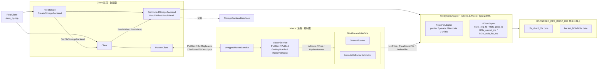

```mermaid
flowchart LR
    CALLER["RealClient<br/>store_py.cpp"]

    subgraph CLIENT["Client 进程 · 数据面"]
        direction TB
        FST["FileStorage<br/>CreateStorageBackend"]
        CL["Client"]
        MC["MasterClient"]
        DSB["DistributedStorageBackend<br/>BatchWrite / BatchRead"]
    end

    subgraph MASTER["Master 进程 · 控制面"]
        direction TB
        WMS["WrappedMasterService"]
        MS["MasterService<br/>PutStart / PutEnd<br/>GetReplicaList / RemoveObject"]
        subgraph DAI["DfsAllocatorInterface"]
            direction LR
            SA["ShardAllocator"]
            BA["ImmutableBucketAllocator"]
        end
    end

    subgraph FSA["FileSystemAdapter（Client 与 Master 各自实例化）"]
        direction TB
        PFA["PosixFsAdapter<br/>pwritev / preadv / ftruncate / unlink"]
        HFA["Hf3fsAdapter<br/>hf3fs_reg_fd / hf3fs_prep_io<br/>hf3fs_submit_ios / hf3fs_wait_for_ios"]
    end

    subgraph MOUNT["MOONCAKE_DFS_ROOT_DIR 共享挂载点"]
        direction TB
        SHARD["dfs_shard_XX.data"]
        BUCKET["bucket_NNNNNN.data"]
    end

    SBI["StorageBackendInterface"]

    CALLER --> CL
    CALLER --> FST
    FST --> DSB
    FST -->|SetDfsStorageBackend| CL
    CL -->|BatchWrite / BatchRead| DSB
    CL --> MC

    MC <-->|PutStart / GetReplicaList<br/>DistributedFSDescriptor| WMS
    WMS --> MS
    MS -->|Allocate / Free / UpdateAccess| DAI

    DSB --> FSA
    DAI -->|ListFiles / PreallocateFile / DeleteFile| FSA
    FSA --> MOUNT

    DSB -.->|实现| SBI
```
