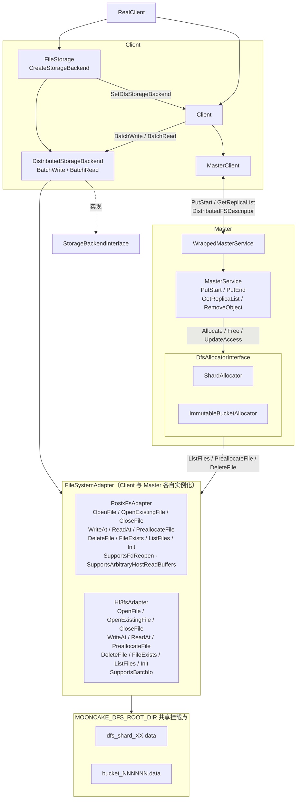

```mermaid
flowchart TB
    CALLER["RealClient"]

    subgraph CLIENT["Client"]
        direction TB
        FST["FileStorage<br/>CreateStorageBackend"]
        CL["Client"]
        MC["MasterClient"]
        DSB["DistributedStorageBackend<br/>BatchWrite / BatchRead"]
        FST --> DSB
        FST -->|SetDfsStorageBackend| CL
        CL -->|BatchWrite / BatchRead| DSB
        CL --> MC
    end

    subgraph MASTER["Master"]
        direction TB
        WMS["WrappedMasterService"]
        MS["MasterService<br/>PutStart / PutEnd<br/>GetReplicaList / RemoveObject"]
        subgraph DAI["DfsAllocatorInterface"]
            direction LR
            SA["ShardAllocator"]
            BA["ImmutableBucketAllocator"]
        end
        WMS --> MS
        MS -->|Allocate / Free / UpdateAccess| DAI
    end

    SBI["StorageBackendInterface"]

    subgraph FSA["FileSystemAdapter（Client 与 Master 各自实例化）"]
        direction LR
        PFA["PosixFsAdapter<br/>OpenFile / OpenExistingFile / CloseFile<br/>WriteAt / ReadAt / PreallocateFile<br/>DeleteFile / FileExists / ListFiles / Init<br/>SupportsFdReopen · SupportsArbitraryHostReadBuffers"]
        HFA["Hf3fsAdapter<br/>OpenFile / OpenExistingFile / CloseFile<br/>WriteAt / ReadAt / PreallocateFile<br/>DeleteFile / FileExists / ListFiles / Init<br/>SupportsBatchIo"]
    end

    subgraph MOUNT["MOONCAKE_DFS_ROOT_DIR 共享挂载点"]
        direction LR
        SHARD["dfs_shard_XX.data"]
        BUCKET["bucket_NNNNNN.data"]
    end

    CALLER --> FST
    CALLER --> CL

    MC <-->|PutStart / GetReplicaList<br/>DistributedFSDescriptor| WMS

    DSB --> FSA
    DAI -->|ListFiles / PreallocateFile / DeleteFile| FSA
    DSB -.->|实现| SBI
    FSA --> MOUNT
```
