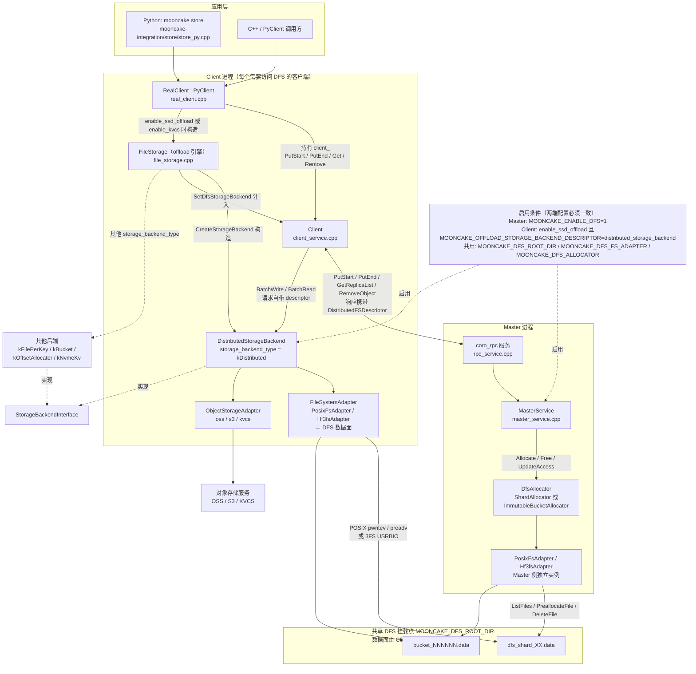

```mermaid
flowchart TB
    subgraph APP["应用层"]
        PY["Python: mooncake.store<br/>mooncake-integration/store/store_py.cpp"]
        CPP["C++ / PyClient 调用方"]
    end

    subgraph CLIENT["Client 进程（每个需要访问 DFS 的客户端）"]
        RC["RealClient : PyClient<br/>real_client.cpp"]
        CL["Client<br/>client_service.cpp"]
        FST["FileStorage（offload 引擎）<br/>file_storage.cpp"]
        DSB["DistributedStorageBackend<br/>storage_backend_type = kDistributed"]
        FSA["FileSystemAdapter<br/>PosixFsAdapter / Hf3fsAdapter<br/>← DFS 数据面"]
        OSA["ObjectStorageAdapter<br/>oss / s3 / kvcs"]
    end

    subgraph MASTER["Master 进程"]
        RPC["coro_rpc 服务<br/>rpc_service.cpp"]
        MS["MasterService<br/>master_service.cpp"]
        AL["DfsAllocator<br/>ShardAllocator 或<br/>ImmutableBucketAllocator"]
        MADP["PosixFsAdapter / Hf3fsAdapter<br/>Master 侧独立实例"]
    end

    subgraph DFS["共享 DFS 挂载点 MOONCAKE_DFS_ROOT_DIR<br/>数据面由 Client 直接读写，不经过 Master"]
        SHARD["dfs_shard_XX.data"]
        BUCKET["bucket_NNNNNN.data"]
    end

    SBI["StorageBackendInterface"]
    OTHER["其他后端<br/>kFilePerKey / kBucket /<br/>kOffsetAllocator / kNvmeKv"]
    OBJ["对象存储服务<br/>OSS / S3 / KVCS"]
    CFG["启用条件（两端配置必须一致）<br/>Master: MOONCAKE_ENABLE_DFS=1<br/>Client: enable_ssd_offload 且<br/>MOONCAKE_OFFLOAD_STORAGE_BACKEND_DESCRIPTOR=distributed_storage_backend<br/>共用: MOONCAKE_DFS_ROOT_DIR / MOONCAKE_DFS_FS_ADAPTER / MOONCAKE_DFS_ALLOCATOR"]

    PY --> RC
    CPP --> RC
    RC -->|持有 client_<br/>PutStart / PutEnd / Get / Remove| CL
    RC -->|enable_ssd_offload 或 enable_kvcs 时构造| FST
    FST -->|CreateStorageBackend 构造| DSB
    FST -->|SetDfsStorageBackend 注入| CL
    FST -. 其他 storage_backend_type .-> OTHER
    CL <-->|PutStart / PutEnd / GetReplicaList / RemoveObject<br/>响应携带 DistributedFSDescriptor| RPC
    RPC --> MS
    MS -->|Allocate / Free / UpdateAccess| AL
    AL --> MADP
    MADP -->|ListFiles / PreallocateFile / DeleteFile| SHARD
    MADP --> BUCKET
    CL -->|BatchWrite / BatchRead<br/>请求自带 descriptor| DSB
    DSB --> FSA
    DSB --> OSA
    FSA -->|POSIX pwritev / preadv<br/>或 3FS USRBIO| SHARD
    FSA --> BUCKET
    OSA --> OBJ
    DSB -. 实现 .-> SBI
    OTHER -. 实现 .-> SBI
    CFG -. 启用 .-> MS
    CFG -. 启用 .-> DSB
```
