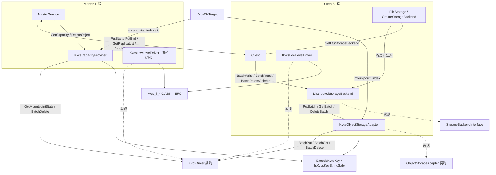

```mermaid
flowchart TB
    subgraph CLIENT["Client 进程"]
        FS["FileStorage / CreateStorageBackend"]
        CL["Client"]
        DSB["DistributedStorageBackend"]
        KOA["KvcsObjectStorageAdapter"]
        KLD["KvcsLowLevelDriver"]
    end

    subgraph MASTER["Master 进程"]
        MS["MasterService"]
        KCP["KvcsCapacityProvider"]
        KLD2["KvcsLowLevelDriver（独立实例）"]
    end

    SBI["StorageBackendInterface"]
    OSA["ObjectStorageAdapter 契约"]
    KD["KvcsDriver 契约"]
    ENC["EncodeKvcsKey / IsKvcsKeyStringSafe"]
    KET["KvcsEfcTarget"]
    SDK["kvcs_ll_* C ABI → EFC"]

    %% 调用 / 依赖：实线
    FS -->|构造并注入| DSB
    FS -->|SetDfsStorageBackend| CL
    CL -->|BatchWrite / BatchRead / BatchDeleteObjects| DSB
    DSB -->|PutBatch / GetBatch / DeleteBatch| KOA
    KOA -->|BatchPut / BatchGet / BatchDelete| KD
    MS <-->|PutStart / PutEnd / GetReplicaList / BatchRemove| CL
    MS -->|GetCapacity / DeleteObject| KCP
    KCP -->|GetMountpointStats / BatchDelete| KD
    KET -->|mountpoint_index| KOA
    KET -->|mountpoint_index / id| KCP
    KOA --> ENC
    KCP --> ENC

    %% 实现 / 继承：虚线
    DSB -. 实现 .-> SBI
    KOA -. 实现 .-> OSA
    KLD -. 实现 .-> KD
    KLD2 -. 实现 .-> KD

    %% 南向：实线
    KLD --> SDK
    KLD2 --> SDK
```
