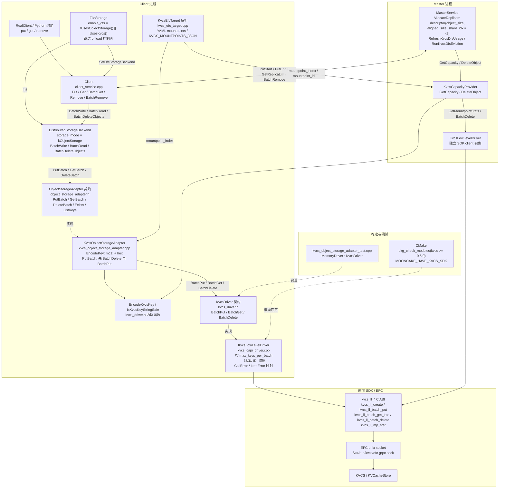

```mermaid
flowchart TB
    subgraph CLIENT["Client 进程"]
        API["RealClient / Python 绑定<br/>put / get / remove"]
        CL["Client<br/>client_service.cpp<br/>Put / Get / BatchGet / Remove / BatchRemove"]
        FS["FileStorage<br/>enable_dfs = !UsesObjectStorage() || UsesKvcs()<br/>跳过 offload 控制面"]
        DSB["DistributedStorageBackend<br/>storage_mode = kObjectStorage<br/>BatchWrite / BatchRead / BatchDeleteObjects"]
        OSA["ObjectStorageAdapter 契约<br/>object_storage_adapter.h<br/>PutBatch / GetBatch / DeleteBatch / Exists / ListKeys"]
        KOA["KvcsObjectStorageAdapter<br/>kvcs_object_storage_adapter.cpp<br/>EncodeKey: mc1: + hex<br/>PutBatch: 先 BatchDelete 再 BatchPut"]
        ENC["EncodeKvcsKey / IsKvcsKeyStringSafe<br/>kvcs_driver.h 内联函数"]
        KD["KvcsDriver 契约<br/>kvcs_driver.h<br/>BatchPut / BatchGet / BatchDelete"]
        KLD["KvcsLowLevelDriver<br/>kvcs_capi_driver.cpp<br/>按 max_keys_per_batch（默认 8）切批<br/>CallError / ItemError 映射"]
        KET["KvcsEfcTarget 解析<br/>kvcs_efc_target.cpp<br/>YAML mountpoints / KVCS_MOUNTPOINTS_JSON"]
    end

    subgraph MASTER["Master 进程"]
        MS["MasterService<br/>AllocateReplicas: descriptor{object_size,<br/>aligned_size, shard_idx = -1}<br/>RefreshKvcsDfsUsage / RunKvcsDfsEviction"]
        KCP["KvcsCapacityProvider<br/>GetCapacity / DeleteObject"]
        KLD2["KvcsLowLevelDriver<br/>独立 SDK client 实例"]
    end

    subgraph SOUTH["南向 SDK / EFC"]
        SDK["kvcs_ll_* C ABI<br/>kvcs_ll_create / kvcs_ll_batch_put<br/>kvcs_ll_batch_get_into / kvcs_ll_batch_delete<br/>kvcs_ll_mp_stat"]
        EFC["EFC unix socket<br/>/var/run/kvcs/efc-grpc.sock"]
        DEV["KVCS / KVCacheStore"]
    end

    subgraph BUILD["构建与测试"]
        CMAKE["CMake<br/>pkg_check_modules(kvcs &gt;= 0.6.0)<br/>MOONCAKE_HAVE_KVCS_SDK"]
        TEST["kvcs_object_storage_adapter_test.cpp<br/>MemoryDriver : KvcsDriver"]
    end

    API --> CL
    FS -->|SetDfsStorageBackend| CL
    FS -->|Init| DSB
    CL -->|BatchWrite / BatchRead / BatchDeleteObjects| DSB
    DSB -->|PutBatch / GetBatch / DeleteBatch| OSA
    OSA -.实现.-> KOA
    KOA --> ENC
    KOA -->|BatchPut / BatchGet / BatchDelete| KD
    KD -.实现.-> KLD
    KET -->|mountpoint_index| KOA
    KLD --> SDK

    MS <-->|PutStart / PutEnd / GetReplicaList / BatchRemove| CL
    MS -->|GetCapacity / DeleteObject| KCP
    KCP -->|GetMountpointStats / BatchDelete| KLD2
    KCP --> ENC
    KET -->|mountpoint_index / mountpoint_id| KCP
    KLD2 --> SDK

    SDK --> EFC
    EFC --> DEV
    CMAKE -.编译门禁.-> KLD
    TEST -.实现.-> KD
```
