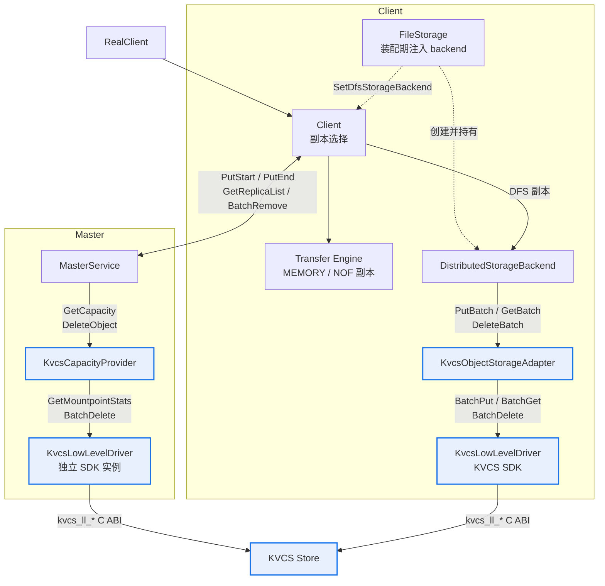

```mermaid
flowchart TB
     RC["RealClient"]

    subgraph CP["Client"]
        direction TB
        CL["Client<br/>副本选择"]
        TE["Transfer Engine<br/>MEMORY / NOF 副本"]
        FS["FileStorage<br/>装配期注入 backend"]
        DSB["DistributedStorageBackend"]
        KOA["KvcsObjectStorageAdapter"]
        KLD["KvcsLowLevelDriver<br/>KVCS SDK"]

        CL --> TE
        CL -->|DFS 副本| DSB
        FS -.->|创建并持有| DSB
        FS -.->|SetDfsStorageBackend| CL
        DSB -->|PutBatch / GetBatch<br/>DeleteBatch| KOA
        KOA -->|BatchPut / BatchGet<br/>BatchDelete| KLD
    end

    subgraph MP["Master"]
        direction TB
        MS["MasterService"]
        KCP["KvcsCapacityProvider"]
        KLD2["KvcsLowLevelDriver<br/>独立 SDK 实例"]

        MS -->|GetCapacity<br/>DeleteObject| KCP
        KCP -->|GetMountpointStats<br/>BatchDelete| KLD2
    end

    STORE["KVCS Store"]

    RC --> CL
    CL <-->|PutStart / PutEnd<br/>GetReplicaList / BatchRemove| MS
    KLD -->|kvcs_ll_* C ABI| STORE
    KLD2 -->|kvcs_ll_* C ABI| STORE

    classDef kvcs fill:#e8f0fe,stroke:#1a73e8,stroke-width:2px;
    class KOA,KLD,KLD2,KCP,STORE kvcs;
```
