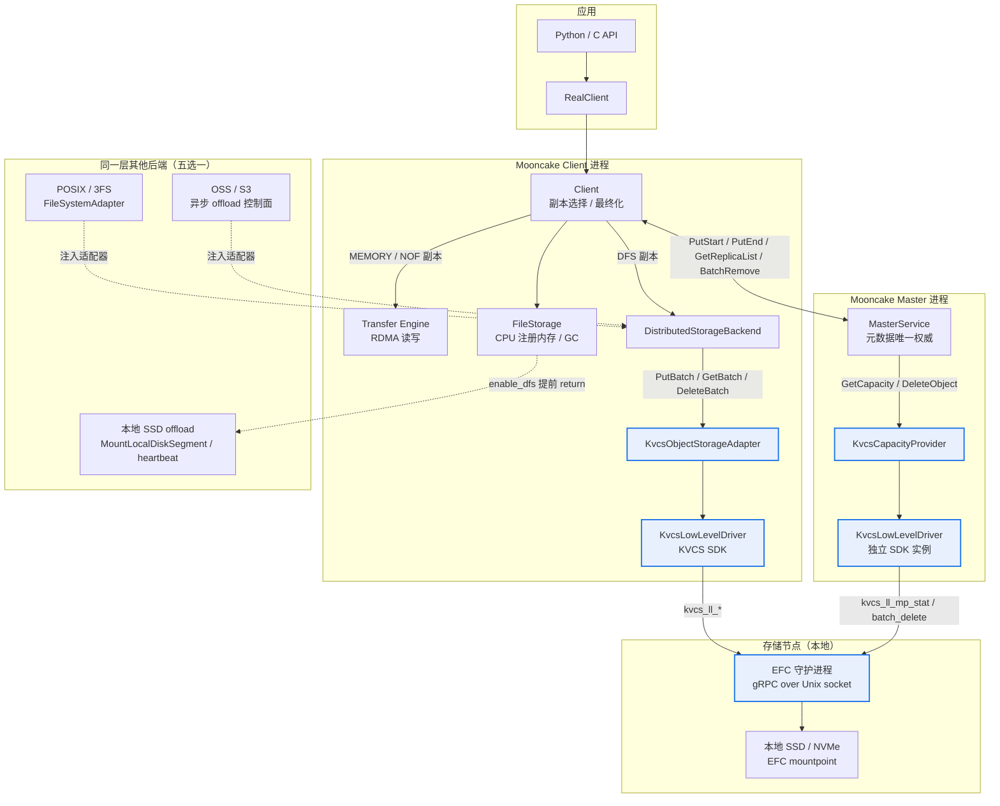

```mermaid
flowchart TB
    subgraph APP["应用"]
        PY["Python / C API"]
        RC["RealClient"]
    end

    subgraph CP["Mooncake Client 进程"]
        CL["Client<br/>副本选择 / 最终化"]
        TE["Transfer Engine<br/>RDMA 读写"]
        FS["FileStorage<br/>CPU 注册内存 / GC"]
        DSB["DistributedStorageBackend"]
        KOA["KvcsObjectStorageAdapter"]
        KLD["KvcsLowLevelDriver<br/>KVCS SDK"]
    end

    subgraph MP["Mooncake Master 进程"]
        MS["MasterService<br/>元数据唯一权威"]
        KCP["KvcsCapacityProvider"]
        KLD2["KvcsLowLevelDriver<br/>独立 SDK 实例"]
    end

    subgraph SN["存储节点（本地）"]
        EFC["EFC 守护进程<br/>gRPC over Unix socket"]
        DISK["本地 SSD / NVMe<br/>EFC mountpoint"]
    end

    subgraph ALT["同一层其他后端（五选一）"]
        PFS["POSIX / 3FS<br/>FileSystemAdapter"]
        OBJ["OSS / S3<br/>异步 offload 控制面"]
        SSD["本地 SSD offload<br/>MountLocalDiskSegment / heartbeat"]
    end

    PY --> RC --> CL

    CL -->|MEMORY / NOF 副本| TE
    CL -->|DFS 副本| DSB
    CL --> FS

    DSB -->|PutBatch / GetBatch / DeleteBatch| KOA
    KOA --> KLD
    KLD -->|kvcs_ll_*| EFC
    EFC --> DISK

    CL <-->|PutStart / PutEnd / GetReplicaList / BatchRemove| MS
    MS -->|GetCapacity / DeleteObject| KCP
    KCP --> KLD2
    KLD2 -->|kvcs_ll_mp_stat / batch_delete| EFC

    PFS -. 注入适配器 .-> DSB
    OBJ -. 注入适配器 .-> DSB
    FS -. enable_dfs 提前 return .-> SSD

    classDef kvcs fill:#e8f0fe,stroke:#1a73e8,stroke-width:2px;
    class KOA,KLD,KLD2,KCP,EFC kvcs;
```
