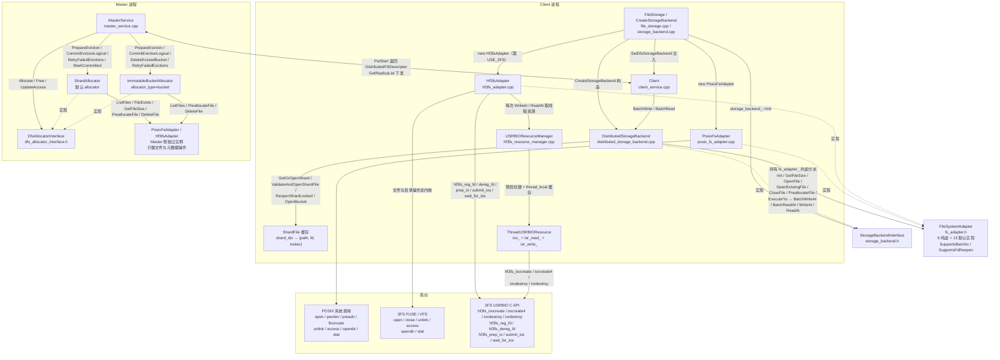

```mermaid
flowchart TB
    subgraph CLIENT["Client 进程"]
        FS["FileStorage / CreateStorageBackend<br/>file_storage.cpp / storage_backend.cpp"]
        CL["Client<br/>client_service.cpp"]
        DSB["DistributedStorageBackend<br/>distributed_storage_backend.cpp"]
        SHC["ShardFile 缓存<br/>shard_idx → {path, fd, mutex}"]
        PFA["PosixFsAdapter<br/>posix_fs_adapter.cpp"]
        HFA["Hf3fsAdapter<br/>hf3fs_adapter.cpp"]
        RM["USRBIOResourceManager<br/>hf3fs_resource_manager.cpp"]
        TR["ThreadUSRBIOResource<br/>iov_ + ior_read_ + ior_write_"]
    end

    subgraph MASTER["Master 进程"]
        MS["MasterService<br/>master_service.cpp"]
        DFSI["DfsAllocatorInterface<br/>dfs_allocator_interface.h"]
        SA["ShardAllocator<br/>默认 allocator"]
        BA["ImmutableBucketAllocator<br/>allocator_type=bucket"]
        MFA["PosixFsAdapter / Hf3fsAdapter<br/>Master 侧独立实例<br/>只做文件与元数据操作"]
    end

    subgraph SOUTH["南向"]
        POSIX["POSIX 系统调用<br/>open / pwritev / preadv / ftruncate<br/>unlink / access / opendir / stat"]
        FUSE["3FS FUSE / VFS<br/>open / close / unlink / access<br/>opendir / stat"]
        USRBIO["3FS USRBIO C API<br/>hf3fs_iovcreate / iorcreate4 / iovdestroy / iordestroy<br/>hf3fs_reg_fd / hf3fs_dereg_fd<br/>hf3fs_prep_io / submit_ios / wait_for_ios"]
    end

    SBI["StorageBackendInterface<br/>storage_backend.h"]
    FSA["FileSystemAdapter<br/>fs_adapter.h<br/>6 纯虚 + 13 默认实现<br/>SupportsBatchIo / SupportsFdReopen"]

    %% ===== 调用 / 持有 =====
    FS -->|CreateStorageBackend 构造| DSB
    FS -->|new PosixFsAdapter| PFA
    FS -->|new Hf3fsAdapter（需 USE_3FS）| HFA
    FS -->|storage_backend_->Init| SBI
    FS -->|SetDfsStorageBackend 注入| CL
    CL -->|BatchWrite / BatchRead| DSB
    MS -->|Allocate / Free / UpdateAccess| DFSI
    MS -->|PrepareEviction / CommitEvictionLogical /<br/>RetryFailedEvictions / MarkCommitted| SA
    MS -->|PrepareEviction / CommitEvictionLogical /<br/>DeleteEvictedBucket / RetryFailedEvictions| BA
    MS <-->|PutStart 返回 DistributedFSDescriptor<br/>GetReplicaList 下发| CL
    DSB -->|持有 fs_adapter_ 并虚分派<br/>Init / GetFileSize / OpenFile /<br/>OpenExistingFile / CloseFile / PreallocateFile /<br/>Execute*Io → BatchWriteAt / BatchReadAt / WriteAt / ReadAt| FSA
    DSB -->|GetOrOpenShard / ValidateAndOpenShardFile /<br/>ReopenShardLocked / OpenBucket| SHC
    SA -->|ListFiles / FileExists / GetFileSize /<br/>PreallocateFile / DeleteFile| MFA
    BA -->|ListFiles / PreallocateFile / DeleteFile| MFA
    HFA -->|每次 WriteAt / ReadAt 取线程资源| RM
    RM -->|惰性创建 + thread_local 缓存| TR
    HFA -->|hf3fs_reg_fd / dereg_fd /<br/>prep_io / submit_ios / wait_for_ios| USRBIO
    TR -->|hf3fs_iovcreate / iorcreate4 /<br/>iovdestroy / iordestroy| USRBIO
    PFA --> POSIX
    HFA -->|文件与目录操作走内核| FUSE

    %% ===== 继承 / 实现 =====
    DSB -. 实现 .-> SBI
    SA -. 实现 .-> DFSI
    BA -. 实现 .-> DFSI
    PFA -. 实现 .-> FSA
    HFA -. 实现 .-> FSA
```
